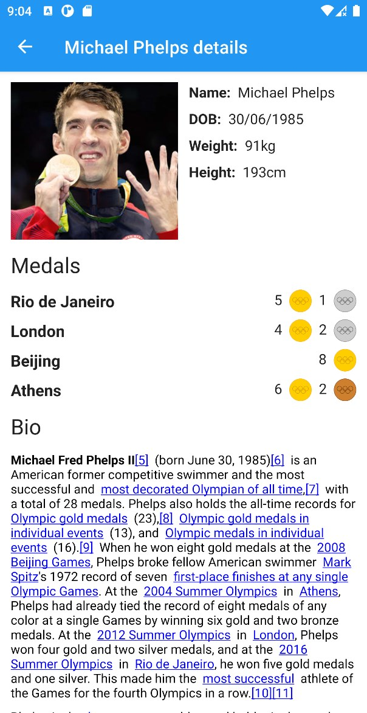

# Introduction

This is OBS showcase project.

# Architecture

Application is based on Jetpack compose for UI, Hilt for dependency injection and has MVVM
architecture. This application is built with Clean Architecture principles in mind.

# Preview

# Screens

### Athlete list

User can preview athletes sorted from most recent to older games. Games that do not contain any
athletes are filtered out. Athletes are sorted by the success of a given games. Success is
calculated by the total amount of points athlete has achieved on a given games. Gold medal equals 5,
silver 3 and bronze 1 point.

### Athlete details

User can preview more information on each athlete.

# Built with

* [Kotlin](https://kotlinlang.org/) - Official programming language for Android development.
* [Compose UI for Android](https://developer.android.com/jetpack/compose) - Android’s modern toolkit
  for building native UI.
* [Android Jetpack](https://developer.android.com/jetpack) - Collection of libraries that help you
  design robust, testable, and maintainable apps.
* [ViewModel](https://developer.android.com/topic/libraries/architecture/viewmodel) - Stores
  UI-related data that isn't destroyed on configuration changes.
* [Hilt-Dagger](https://dagger.dev/hilt/) - Standard library to incorporate Dagger dependency
  injection into an Android application.
* [Hilt-ViewModel](https://developer.android.com/training/dependency-injection/hilt-jetpack) - DI
  for injecting ViewModel.
* [Retrofit](https://square.github.io/retrofit/) - A type-safe HTTP client for Android.
* [Coil](https://github.com/coil-kt/coil) - An image loading library
* [Accompanist](https://github.com/google/accompanist) - Group of libraries that aim to supplement
  Jetpack Compose
* [JUnit](https://junit.org/junit4/) - Unit testing framework
* [Mockk](https://mockk.io/) - Framework used for mocking in unit tests